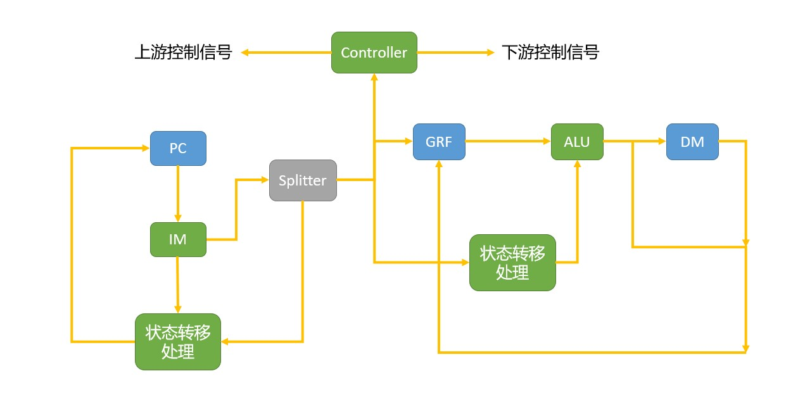

## P3 Logisim单周期CPU

### 设计草稿

#### 模块设计

##### GRF（通用寄存器组）

- 用具有写使能的寄存器实现，寄存器总数为 32 个，应具有**异步复位**功能。
- **0 号寄存器**的值始终保持为 0。其他寄存器**初始值（复位后）均为 0**，无需专门设置。

|     信号     |  IO  |            作用            |
| :----------: | :--: | :------------------------: |
|   A1[4:0]    |  IN  |        Instr[25:21]        |
|   A2[4:0]    |  IN  |        Instr[20:16]        |
|   A3[4:0]    |  IN  | 将要写入寄存器组的数据地址 |
|   WD[31:0]   |  IN  |   将要写入寄存器组的数据   |
|     Clk      |  IN  |          时钟信号          |
|    Reset     |  IN  |        异步复位信号        |
| RE(RegWrite) |  IN  | 控制寄存器组能否写入的信号 |
|  RD1[31:0]   | OUT  |   A1地址对应的寄存器数据   |
|  RD2[31:0]   | OUT  |   A2地址对应的寄存器数据   |

##### ALU（算术逻辑单元）

- 提供 32 位加、减、或运算及大小比较功能。
- 加减法按无符号处理（不考虑溢出）。

|     信号     |  IO  |                             作用                             |
| :----------: | :--: | :----------------------------------------------------------: |
|   A[31:0]    |  IN  |                          ALU计算数A                          |
|   B[31:0]    |  IN  |                          ALU计算数B                          |
| ALUCtrl[2:0] |  IN  | ALU功能控制信号 0'b000 & 0'b001 \| 0'b010 + 0'b011 - |
| Result[31:0] | OUT  |                         ALU计算结果                          |
|     Zero     | OUT  |            判断是否跳转的信号 beq时为判断相等             |

##### DM（数据存储器）

- 使用 RAM 实现，容量为 32bit × 32字，应具有**异步复位**功能，复位值为 0x00000000。
- **起始地址：0x00000000**。
- RAM 应使用双端口模式，即设置 RAM 的 **Data Interface** 属性为 **Separate load and store ports**。

|       信号        |  IO  |          作用           |
| :---------------: | :--: | :---------------------: |
|  A(MemAddr)[4:0]  |  IN  |    取出RAM数据的地址    |
| WD(MemData)[31:0] |  IN  |      存入RAM的数据      |
|        Clk        |  IN  |        时钟信号         |
|       Reset       |  IN  |      异步复位信号       |
|   WE(MemWrite)    |  IN  | 控制RAM是否能写入的信号 |
|     RD[31:0]      | OUT  |    从RAM中读出的信号    |

##### EXT（扩展单元）

- 可以使用 Logisim 内置的 Bit Extender。

|    信号     |  IO  |                         作用                         |
| :---------: | :--: | :--------------------------------------------------: |
| Imm16[15:0] |  IN  |                   指令的16位立即数                   |
|    ExtOp    |  IN  | 立即数扩展的控制信号 1'b0 符号扩展 1'b1 零扩展 |
| Ext32[31:0] | OUT  |                    扩展后的立即数                    |

##### IFU（取指令单元）

- 内部包括 PC（程序计数器）、IM（指令存储器）及相关逻辑。
- PC 用寄存器实现，应具有**异步复位**功能，复位值为起始地址。
- **起始地址：0x00000000。**
- IM 用 ROM 实现，容量为 32bit × 32字。
- IM 实际地址宽度仅为 5 位，需要使用恰当的方法将 PC 中储存的地址同 IM 联系起来。

|    信号     |  IO  |     作用     |
| :---------: | :--: | :----------: |
|  nPC[31:0]  |  IN  |   下一个PC   |
|     Clk     |  IN  |   时钟信号   |
|    Reset    |  IN  | 异步复位信号 |
| Instr[31:0] | OUT  | 要执行的指令 |
|  PC[31:0]   | OUT  |   这一个PC   |

##### Controller（控制器）

- 使用与或门阵列构造控制信号。

|     信号      |  IO  |             作用             |
| :-----------: | :--: | :--------------------------: |
|  OPCode[5:0]  |  IN  |         标识命令种类         |
|  RegDst[1:0]  | OUT  | 选择寄存器需要写入的目的地址 |
|    ALUSrc     | OUT  |    选择ALU数据B的信号来源    |
|   RegWrite    | OUT  |        寄存器写入信号        |
|   MemWrite    | OUT  |         RAM写入信号          |
| MemToReg[1:0] | OUT  |     选择存入寄存器的数据     |
|     ExtOp     | OUT  |         扩展选择信号         |
|    Branch     | OUT  |           分支指令           |
|     Jump      | OUT  |           跳转指令           |
|  ALUOp[2:0]   | OUT  |       ALUCtrl控制指令        |

| 指令 | Adder.A | Adder.B |     PC     | IM.A | RA1  | RA2  |  WA  |   WD    |  ALU   |  ALU.B   | DM.A | DM.WD  |  Ext  | Nadd.A | Nadd.B |  Shift   |
| :--: | :-----: | :-----: | :--------: | :--: | :--: | :--: | :--: | :-----: | :----: | :------: | :--: | :----: | :---: | :----: | :----: | :------: |
| R型  |   PC    |    4    |   Adder    |  PC  |  Rs  |  Rt  |  Rd  |   ALU   | RF.RD1 |  RF.RD2  |      |        |       |        |        |          |
|  lw  |   PC    |    4    |   Adder    |  PC  |  Rs  |      |  Rt  |  DM.RD  | RF.RD1 | sign_ext | ALU  |        | imm16 |        |        |          |
|  sw  |   PC    |    4    |   Adder    |  PC  |  Rs  |  Rt  |      |         | RF.RD1 | sign_ext | ALU  | RF.RD2 | imm16 |        |        |          |
| beq  |   PC    |    4    | Adder/Nadd |  PC  |  Rs  |  Rt  |      |         | RF.RD1 |  RF.RD2  |      |        | imm16 | Adder  | Shift  | Sign_ext |
| ori  |   PC    |    4    |   Adder    |  PC  |  Rs  |      |  Rt  |   ALU   | RF.RD1 | zero_ext |      |        | imm16 |        |        |          |
| lui  |   PC    |    4    |   Adder    |  PC  |      |      |  Rt  | imm+016 |        |          |      |        |       |        |        |          |
| nop  |   PC    |    4    |   Adder    |  PC  |      |      |      |         |        |          |      |        |       |        |        |          |

|               |  R   |  lw  |  sw  | beq  | lui  | ori  | nop  |
| :-----------: | :--: | :--: | :--: | :--: | :--: | :--: | :--: |
|      Op5      |  0   |  1   |  1   |  0   |  0   |  0   |  0   |
|      Op4      |  0   |  0   |  0   |  0   |  0   |  0   |  0   |
|      Op3      |  0   |  0   |  1   |  0   |  1   |  1   |  0   |
|      Op2      |  0   |  0   |  0   |  1   |  1   |  1   |  0   |
|      Op1      |  0   |  1   |  1   |  0   |  1   |  0   |  0   |
|      Op0      |  0   |  1   |  1   |  0   |  1   |  1   |  0   |
|    RegDst     |  1   |  0   |  x   |  x   |  0   |  0   |  x   |
|    ALUSrc     |  0   |  1   |  1   |  0   |  x   |  1   |  x   |
|   RegWrite    |  1   |  1   |  0   |  0   |  1   |  1   |  x   |
|    MemRead    |  0   |  1   |  0   |  0   |  0   |  0   |  x   |
|   MemWrite    |  0   |  0   |  1   |  0   |  0   |  0   |  x   |
| MemToReg[1:0] |  00  |  10  |  x0  |  x0  |  x1  |  00  |  xx  |
|     EXTOp     |  0   |  0   |  0   |  0   |  0   |  1   |  x   |
|    Branch     |  0   |  0   |  0   |  1   |  0   |  0   |  x   |
|  ALUOp[2:0]   | 000  | 001  | 001  | 010  | 011  | 111  | xxx  |

##### ALUCtroller（算数单元控制器）

- 使用与或门阵列构造控制信号。

|    信号    |  IO  |      作用       |
| :--------: | :--: | :-------------: |
| Funct[5:0] |  IN  |  选择R指令类型  |
| ALUOp[2:0] |  IN  | ALUCtrl控制信号 |
|  ALUCtrl   | OUT  |   ALU控制信号   |

| 指令 | Func[5:0] | ALUOp[2:0] | 类型 | ALUCtrl[2:0] |
| :--: | :-------: | :--------: | :--: | :----------: |
|  lw  |  xxxxxx   |    001     |  加  |     010      |
|  sw  |  xxxxxx   |    001     |  加  |     010      |
| beq  |  xxxxxx   |    010     |  减  |     011      |
| lui  |  xxxxxx   |    011     |  x   |     111      |
| ori  |  xxxxxx   |    111     |  或  |     001      |
| addu |  100001   |    000     |  加  |     010      |
| subu |  100011   |    000     |  减  |     011      |

#### 设计草稿

### 思考题

1. 上面我们介绍了通过 FSM 理解单周期 CPU 的基本方法。请大家指出单周期 CPU 所用到的模块中，哪些发挥状态存储功能，哪些发挥状态转移功能。

   * 状态存储功能：IFU的PC，GRF，DM；
   * 状态转移功能：next_PC的计算模块，Controller和ALUContronller，ALU，IM。

2. 现在我们的模块中 IM 使用 ROM， DM 使用 RAM， GRF 使用 Register，这种做法合理吗？ 请给出分析，若有改进意见也请一并给出。

   - 合理； 
   - ROM 是只读存储器，负责读出指令PC信号要求位置的指令，而且断电后数据不清空；
   - RAM是随机存取储存器，可以在任意位置读写数据，速度相对更快，适合内存的要求；
   - Register是寄存器，速度快，可同时平行读写。

3. 在上述提示的模块之外，你是否在实际实现时设计了其他的模块？如果是的话，请给出介绍和设计的思路。

   1. 添加了Splitter模块，输入Instruction后，对R，I和J三种指令所需的各个数位进行了集成输出，便于满足不同指令对于不同编码位段的需求。
   2. 将ALUController与Controller分离，单独用来控制ALU输出信号的选择。

4. 事实上，实现 `nop` 空指令，我们并不需要将它加入控制信号真值表，为什么？

   `OPCode == 0‘b000000 && Funct == 0’b000000`可知`nop`为sll指令，等价于` sll $0, $0, 0`。

   因此`nop`本身不会对CPU的状态存储和状态转移产生任何实质性的影响。

5. 上文提到，MARS 不能导出 PC 与 DM 起始地址均为 0 的机器码。实际上，可以避免手工修改的麻烦。请查阅相关资料进行了解，并阐释为了解决这个问题，你最终采用的方法。

   加一个模块，当地址大于0x3000时减去0x3000。

6. 阅读 Pre 的“MIPS 指令集及汇编语言”一节中给出的测试样例，评价其强度（可从各个指令的覆盖情况，单一指令各种行为的覆盖情况等方面分析），并指出具体的不足之处。

   - 覆盖了`ori`, `lui`, `add`, `sw`, `lw`, `beq`指令（本身并未涉及sub），指令覆盖程度很高。
   - `lui`测试了正数和负数的情况，测试比较全面。
   - 对`add`和`ori`考虑了0左右和32位左右的情况，测试了正正、正负和负负的情况，测试比较全面。
   - 对`beq`考虑了相等和不相等的情况，测试比较全面；但没有考虑向后跳转，应该测试offset为负数的情况。
   - `sw`和`lw`的offset量均未考虑负数情况，应该设计例如`sw $t0, -4($t1)`这种指令进行测试。
   - 未测试对`$0`寄存器进行写入的情况，应该设计比如`add $0, $s0, $t0`这种指令观察是否对不当地对`$0`进行了修改.

